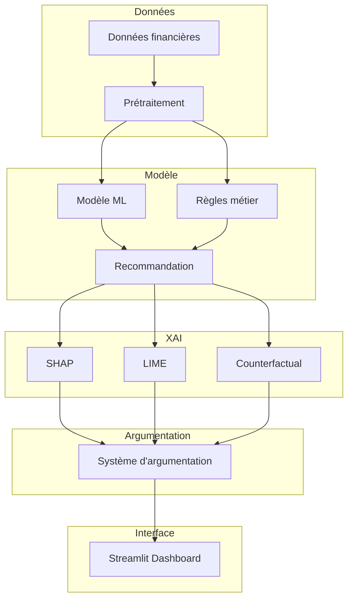

# Plan détaillé - Projet 48 : IA Explicable pour Décisions d'Investissement

## Équipe
- Lans Léo
- Esnault Wandrille
- Jezequel Martin

## Vue d'ensemble du projet

Ce projet vise à développer un système d'IA explicable (XAI) pour les décisions d'investissement, combinant un modèle de recommandation avec des techniques d'explicabilité et un système d'argumentation pour fournir des justifications compréhensibles et auditables.

## Architecture du système



## Étapes détaillées

### 1. Structure du projet et environnement de développement

**Objectif :** Mettre en place une structure de projet claire et un environnement de développement fonctionnel.

**Sous-tâches :**
- [ ] Créer la structure de dossiers du projet
  ```
  PROJET 48/
  ├── data/
  │   ├── raw/
  │   ├── processed/
  │   └── external/
  ├── notebooks/
  │   ├── 01_exploration.ipynb
  │   ├── 02_preprocessing.ipynb
  │   └── 03_modeling.ipynb
  ├── src/
  │   ├── data/
  │   │   ├── __init__.py
  │   │   ├── load_data.py
  │   │   └── preprocess.py
  │   ├── models/
  │   │   ├── __init__.py
  │   │   ├── ml_model.py
  │   │   ├── rule_based.py
  │   │   └── hybrid_model.py
  │   ├── xai/
  │   │   ├── __init__.py
  │   │   ├── shap_explainer.py
  │   │   ├── lime_explainer.py
  │   │   └── counterfactual.py
  │   ├── argumentation/
  │   │   ├── __init__.py
  │   │   ├── argument_builder.py
  │   │   └── explanation_generator.py
  │   └── utils/
  │       ├── __init__.py
  │       └── config.py
  ├── app/
  │   ├── app.py
  │   └── pages/
  ├── tests/
  ├── requirements.txt
  ├── setup.py
  └── README.md
  ```

- [ ] Créer le fichier `requirements.txt` avec les dépendances
  ```
  # Data manipulation
  pandas>=2.0.0
  numpy>=1.24.0
  
  # Machine Learning
  scikit-learn>=1.3.0
  xgboost>=2.0.0
  lightgbm>=4.0.0
  
  # XAI
  shap>=0.42.0
  lime>=0.2.0
  alibi>=0.9.0
  
  # Visualization
  matplotlib>=3.7.0
  seaborn>=0.12.0
  plotly>=5.17.0
  
  # Web Interface
  streamlit>=1.28.0
  
  # Argumentation
  tweetyproject>=1.0.0
  
  # LLM (optionnel)
  openai>=1.0.0
  langchain>=0.1.0
  
  # Utilities
  python-dotenv>=1.0.0
  pyyaml>=6.0.0
  ```

- [ ] Créer le fichier `setup.py` pour l'installation du package

- [ ] Créer le fichier `.env.example` pour les variables d'environnement

- [ ] Configurer le fichier `.gitignore`

### 2. Collecte et préparation des données financières

**Objectif :** Obtenir et préparer un jeu de données financier adapté à l'entraînement du modèle.

**Sous-tâches :**
- [ ] Identifier les sources de données financières
  - Options : Yahoo Finance, Alpha Vantage, Kaggle datasets, données simulées
  
- [ ] Définir les features pertinentes pour l'investissement
  - Ratios financiers (P/E, P/B, ROE, ROA, etc.)
  - Indicateurs techniques (RSI, MACD, moyennes mobiles)
  - Données macroéconomiques
  - Sentiment du marché

- [ ] Implémenter le module de chargement des données (`src/data/load_data.py`)
  - Fonction pour charger les données depuis différentes sources
  - Gestion des API keys
  - Cache des données

- [ ] Implémenter le module de prétraitement (`src/data/preprocess.py`)
  - Nettoyage des données (valeurs manquantes, outliers)
  - Feature engineering
  - Normalisation/standardisation
  - Split train/validation/test

- [ ] Créer le notebook d'exploration (`notebooks/01_exploration.ipynb`)
  - Analyse descriptive des données
  - Visualisation des distributions
  - Corrélation entre features

### 3. Implémentation du modèle de recommandation (approche hybride)

**Objectif :** Développer un modèle hybride combinant ML et règles métier pour générer des recommandations d'investissement.

**Sous-tâches :**

**3.1 Modèle Machine Learning**
- [ ] Implémenter `src/models/ml_model.py`
  - Choix de l'algorithme : Random Forest ou Gradient Boosting (XGBoost/LightGBM)
  - Ces modèles offrent un bon compromis performance/interprétabilité
  - Entraînement avec cross-validation
  - Optimisation des hyperparamètres (GridSearch/RandomSearch/Optuna)
  - Évaluation des performances (accuracy, precision, recall, F1, AUC)

- [ ] Créer le notebook de modélisation (`notebooks/03_modeling.ipynb`)
  - Expérimentation avec différents modèles
  - Comparaison des performances
  - Analyse des feature importances

**3.2 Modèle basé sur des règles**
- [ ] Implémenter `src/models/rule_based.py`
  - Définir des règles métier basées sur les ratios financiers
  - Exemples de règles :
    - Si P/E < 15 et ROE > 15% → ACHETER
    - Si P/E > 30 ou dette/equity > 2 → VENDRE
    - Si RSI < 30 → SURVENDU (signal d'achat)
    - Si RSI > 70 → SURACHETÉ (signal de vente)
  - Système de scoring pondéré

**3.3 Modèle hybride**
- [ ] Implémenter `src/models/hybrid_model.py`
  - Combinaison des prédictions ML et des règles
  - Approches possibles :
    - Vote majoritaire
    - Moyenne pondérée des scores
    - ML pour les cas complexes, règles pour les cas évidents
  - Mécanisme de confiance pour chaque recommandation

### 4. Intégration des techniques XAI

**Objectif :** Implémenter plusieurs techniques d'explicabilité pour comprendre et justifier les décisions du modèle.

**Sous-tâches :**

**4.1 SHAP (SHapley Additive exPlanations)**
- [ ] Implémenter `src/xai/shap_explainer.py`
  - Calcul des valeurs SHAP pour chaque prédiction
  - Visualisation globale (feature importance, summary plot)
  - Visualisation locale (force plot, waterfall plot)
  - Explication des interactions entre features

**4.2 LIME (Local Interpretable Model-agnostic Explanations)**
- [ ] Implémenter `src/xai/lime_explainer.py`
  - Explication locale des prédictions
  - Génération d'exemples synthétiques
  - Visualisation des features importantes pour une prédiction spécifique

**4.3 Counterfactual Explanations**
- [ ] Implémenter `src/xai/counterfactual.py`
  - Génération de scénarios contrefactuels
  - "Quelles conditions auraient changé la recommandation ?"
  - Utilisation de la bibliothèque Alibi
  - Contraintes de réalisme sur les scénarios

### 5. Développement du système d'argumentation

**Objectif :** Structurer les explications en arguments cohérents et compréhensibles.

**Sous-tâches :**

**5.1 Construction d'arguments**
- [ ] Implémenter `src/argumentation/argument_builder.py`
  - Définir un schéma d'argument (prémisse, conclusion, force)
  - Convertir les explications XAI en arguments structurés
  - Hiérarchiser les arguments (arguments primaires, secondaires)
  - Gérer les conflits entre arguments

**5.2 Génération d'explications en langage naturel**
- [ ] Implémenter `src/argumentation/explanation_generator.py`
  - Template-based approach pour générer du texte
  - Option : Utilisation d'un LLM pour des explications plus riches
  - Adaptation du niveau de détail selon l'utilisateur
  - Génération d'explications multi-niveaux (résumé, détaillé, technique)

**5.3 Structure des explications**
- [ ] Définir le format des explications
  - Résumé de la recommandation
  - Facteurs principaux favorisant la décision
  - Facteurs défavorables
  - Comparaison avec des scénarios alternatifs
  - Niveau de confiance

### 6. Création de l'interface de visualisation avec Streamlit

**Objectif :** Développer une interface utilisateur interactive pour présenter les recommandations et leurs explications.

**Sous-tâches :**

**6.1 Structure de l'application**
- [ ] Créer `app/app.py` - Application principale
- [ ] Créer les pages dans `app/pages/`
  - `01_dashboard.py` - Vue d'ensemble
  - `02_analysis.py` - Analyse détaillée
  - `03_comparison.py` - Comparaison d'actifs
  - `04_settings.py` - Paramètres

**6.2 Fonctionnalités de l'interface**
- [ ] Page Dashboard
  - Sélection d'un actif financier
  - Affichage de la recommandation (ACHETER/VENDRE/CONSERVER)
  - Score de confiance
  - Résumé de l'explication

- [ ] Page Analyse détaillée
  - Graphiques SHAP (feature importance, force plot)
  - Explication LIME locale
  - Scénarios contrefactuels
  - Arguments structurés
  - Historique des recommandations

- [ ] Page Comparaison
  - Comparaison de plusieurs actifs
  - Matrice de similarité des explications
  - Analyse comparative des facteurs

- [ ] Page Paramètres
  - Configuration du modèle
  - Ajustement des pondérations
  - Choix du niveau de détail des explications

**6.3 Design et UX**
- [ ] Utiliser un thème cohérent
- [ ] Ajouter des visualisations interactives (Plotly)
- [ ] Inclure des tooltips et légendes
- [ ] Optimiser pour différents écrans

### 7. Tests et validation

**Objectif :** Assurer la qualité et la fiabilité du système.

**Sous-tâches :**
- [ ] Tests unitaires pour chaque module
  - Tests de chargement des données
  - Tests de prétraitement
  - Tests des modèles
  - Tests des explicateurs XAI
  - Tests du système d'argumentation

- [ ] Tests d'intégration
  - Flux de données complet
  - Intégration XAI + Argumentation
  - Intégration avec l'interface

- [ ] Validation du modèle
  - Backtesting sur données historiques
  - Comparaison avec des benchmarks
  - Analyse des cas d'échec

- [ ] Validation des explications
  - Évaluation de la qualité des explications
  - Tests utilisateurs (si possible)
  - Vérification de la cohérence

### 8. Documentation

**Objectif :** Documenter le projet pour faciliter la compréhension et la maintenance.

**Sous-tâches :**
- [ ] Mettre à jour le README.md principal
  - Description du projet
  - Installation
  - Utilisation
  - Structure du code

- [ ] Documenter le code (docstrings)
  - Conventions Google ou NumPy
  - Description des fonctions et classes
  - Exemples d'utilisation

- [ ] Créer un rapport technique
  - Méthodologie
  - Résultats
  - Limitations
  - Perspectives

- [ ] Créer un guide utilisateur
  - Comment utiliser l'interface
  - Interprétation des explications
  - Bonnes pratiques

## Technologies recommandées

| Composant | Technologie | Justification |
|-----------|-------------|---------------|
| Langage | Python | Standard en ML/Finance |
| ML | XGBoost/LightGBM | Performance + interprétabilité |
| XAI | SHAP, LIME, Alibi | Standards de l'industrie |
| Argumentation | TweetyProject | Framework dédié |
| Interface | Streamlit | Rapide à développer, Python natif |
| Visualisation | Plotly, Matplotlib | Graphiques interactifs |
| LLM (optionnel) | OpenAI API / LangChain | Explications riches |

## Références à consulter

1. **CFA Institute (2025)** - Explainable AI in Finance: Addressing the Needs of Diverse Stakeholders
2. **arXiv (2025)** - A Systematic Review of Explainable AI in Finance
3. **BIS (2024)** - How regulators can address AI explainability
4. **AI Review (2024)** - Explainable AI (XAI) in finance: a systematic literature review

## Livrables attendus

1. Code source complet et fonctionnel
2. Interface utilisateur interactive
3. Documentation technique
4. Rapport de projet
5. Présentation (si requis)

## Risques et mitigations

| Risque | Mitigation |
|--------|-----------|
| Données insuffisantes | Utiliser des données publiques ou simulées |
| Complexité du système | Commencer par un MVP, itérer progressivement |
| Performance du modèle | Tester plusieurs algorithmes, optimiser |
| Qualité des explications | Validation utilisateur, itération |
| Contraintes de temps | Prioriser les fonctionnalités essentielles |

## Calendrier suggéré

Ce projet peut être divisé en plusieurs sprints :

- **Sprint 1** : Structure + Données (Étapes 1-2)
- **Sprint 2** : Modèle ML (Étape 3.1)
- **Sprint 3** : Modèle hybride (Étapes 3.2-3.3)
- **Sprint 4** : XAI (Étape 4)
- **Sprint 5** : Argumentation (Étape 5)
- **Sprint 6** : Interface (Étape 6)
- **Sprint 7** : Tests + Documentation (Étapes 7-8)
